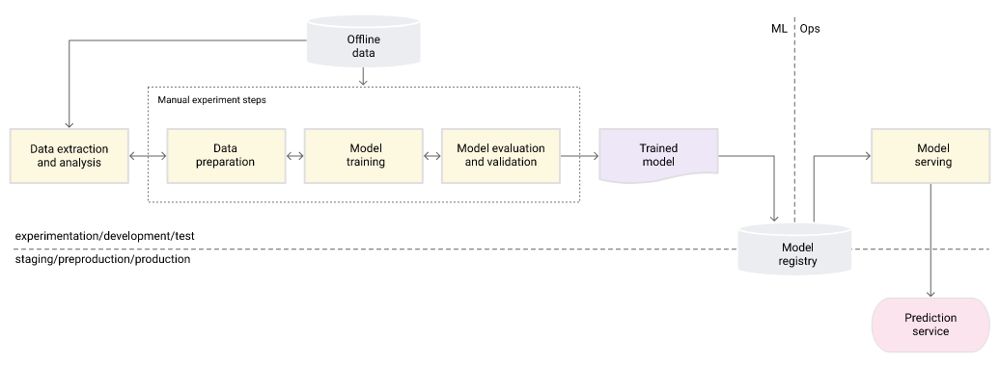

## MIIA Pothole Image Classification Challenge

This knowledge challenge was designed for Leaderex and AI Expo, taking place on 3 and 4 September 2019, respectively. This competition is open to anyone and will remain open to allow the Zindi community to learn and test their skills.

Potholes have become a huge problem for most drivers. With the South African government spending over R22 billion over the past 3 years on pothole repair programs and the Automobile Association(AA) acknowledging more than 5% of road deaths to unmaintained road structure (potholes).

The objective of this challenge is to create a machine learning model to accurately predict the likelihood that an image contains a pothole.

#### Evaluation

The evaluation metric for this challenge is the Area Under the Curve.

The label is the likelihood that the image contains a pothole. Values can be from 0 to 1.

Your submission file should look like:

```
id                   label
AEJGkTGsvGnwBVQ       .543254
AEPaZSgFfneYkLS       0
AEjDuKGztTuzjDC       1
```

## Pipeline

This project uses the **MLOps Level 0: Manual Process**.


## Methodology

We developed a custon CNN (1 input layer, 3 conv2D layers, a flatten layer, a dense layer & softmax layer) for this task. We used a keras-tuner to discover the best hyperparameters that gave us the best validation loss. The lowest validation loss, given compute constraints was 0.04 and the accuracy achieved was 97%.


## How to install

Clone the repository

```
https://github.com/MartinKalema/MIIA-Pothole-Image-classification.git
```

Create a conda environment after opening the repository and activate it

```
conda create -n classifier python=3.8 -y
conda activate kidney
```

Install the requirements

```
pip install -r requirements.txt
```

This Project is connected to Dagshub so all my experiments are sent to dagshub and can be viewed on dagshub itself or on the mlflow platform integrated there.

MLflow is a production grade experiments tracker for managing end-to-end machine learning lifecycle. It helps with experiments tracking, packaging code into reproducible runs and sharing and deploying models.

## Local Experiment tracking

Do not set the tracking uri using the line of code below. All experiments will be stored inside an auto generated folder called mlruns.

```
mlflow.set_tracking_uri()
```

Use the command below to view them in the mlflow web interface

```
mlflow ui
```

## Online Experiment tracking with Dagshub

Connect your github project to your Dagshub account. Visit dagshub here https://dagshub.com

Add the URI, USERNAME && PASSWORD variables to your environment by running the commands below.

```python
export MLFLOW_TRACKING_URI=https://dagshub.com/kalema3502/MIIA-Pothole-Image-classification.mlflow
```

```python
export MLFLOW_TRACKING_USERNAME=kalema3502
```

```python
export MLFLOW_TRACKING_PASSWORD=fb3845efcc3b2e46a4157b1d2c977a21e02dd16e
```

If these are not added to your working environment, the experiment data will be stored in your project root in a folder called **mlruns.**

## DVC(Data Version Control) Setup.

Its a tool we used to automate our pipeline. Initialize dvc inside your project using the command below.

```
dvc init
```

Add the project pipelines to the dvc.yaml file, then run the command below.

```
dvc repro
```

To view the pipeline structure, use the command below

```
dvc dag
```

## AWS CI/CD Deployment with Github Actions

- Login to the AWS console
- Create an IAM user for deployment
- The user should have EC2 & ECR access. The deployment steps are mentioned below,

  1. Build the docker image of the source code
  2. Push your docker image to the ECR
  3. Launch your EC2
  4. Pull your image from the ECR to the EC2
  5. Launch your docker image in the EC2

- Policy

  1. Amazon EC2 Container Registry Access
  2. Amazon EC2 Full Access

- Create EC2 repo to save docker image
  ```
  save the URI: 566373416292.dkr.ecr.us-east-1.amazonaws.com/chicken
  ```
- Create Ubuntu EC2 VM
- Install Docker on the EC2 Machine

  ```
      #optional

      sudo apt-get update -y

      sudo apt-get upgrade

      #required

      curl -fsSL https://get.docker.com -o get-docker.sh

      sudo sh get-docker.sh

      sudo usermod -aG docker ubuntu

      newgrp docker
  ```

- Configure EC2 as self-hosted runner
  ```
  setting > actions > runner > new self hosted runner > choose os >
  ```
- Setup github secrets

  ```
      AWS_ACCESS_KEY_ID=

      AWS_SECRET_ACCESS_KEY=

      AWS_REGION = us-east-1

      AWS_ECR_LOGIN_URI = demo >>  566373416292.dkr.ecr.ap-south-1.amazonaws.com
  ```
